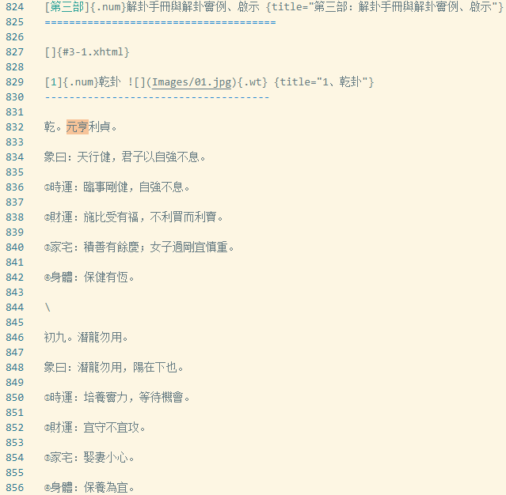

# 图书内容提取

非通用代码，仅提供思路

演示的书籍是易经解卦，从书中提取格式化的卦象和卦辞

书籍转换文本使用智谱清言
内容抽取用的gemini-2.0-flash，目前只有这个模型支持无限上下文长度

# 结果示例
从几十万字的书籍中提取格式化的内容，原书截图：



结果示例：

``` json
{
  "卦名": "乾卦",
  "卦辞": "元亨利贞",
  "象曰": "天行健，君子以自强不息",
  "时运": "临事刚健，自强不息",
  "财运": "施比受有福，不利买而利卖",
  "家宅": "积善有余庆；女子过刚宜慎重",
  "身体": "保健有恒",
  "动爻": [
    {
      "爻位": "初九",
      "爻辞": "潜龙勿用",
      "象曰": "潜龙勿用，阳在下也",
      "时运": "培养实力，等待机会",
      "财运": "宜守不宜攻",
      "家宅": "娶妻小心",
      "身体": "保养为宜"
    },
    {
      "爻位": "九二",
      "爻辞": "见龙在田，利见大人",
      "象曰": "见龙在田，德施普也",
      "时运": "得贵人之助，有发展机会",
      "财运": "开始涨价，官方采购",
      "家宅": "婚姻大吉",
      "身体": "运动健身"
    },
    {
      "爻位": "九三",
      "爻辞": "君子终日乾乾，夕惕若；厉，无咎",
      "象曰": "终日乾乾，反复道也",
      "时运": "功名未显，戒慎免咎",
      "财运": "日夜防范，可脱险获利",
      "家宅": "勤俭保家；不宜攀结高亲",
      "身体": "小心保养"
    },
    {
      "爻位": "九四",
      "爻辞": "或跃在渊，无咎",
      "象曰": "或跃在渊，进无咎也",
      "时运": "一举成名",
      "财运": "物价高涨，可保无咎",
      "家宅": "有一时振兴之象",
      "身体": "继续健身"
    },
    {
      "爻位": "九五",
      "爻辞": "飞龙在天，利见大人",
      "象曰": "飞龙在天，大人造也",
      "时运": "直上云霄",
      "财运": "五谷之类的贸易，物价飞升，有官府支持",
      "家宅": "富贵之家",
      "身体": "蒙天所召，不吉"
    },
    {
      "爻位": "上九",
      "爻辞": "亢龙有悔",
      "象曰": "亢龙有悔，盈不可久也",
      "时运": "由满招损，退而自省",
      "财运": "过盈则必有亏",
      "家宅": "婚嫁不利",
      "身体": "命在旦夕"
    }
  ]
}
```

